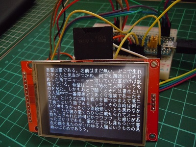

# Arduino用漢字フォントライブラリ SDカード版

## 概要

このライブラリはArduino用の漢字フォントドライバーライブラリです。  
SDカードに格納したフォントデータを逐次参照し、UTF-8コードに対応する漢字フォントデータの取得を可能にします。 

## ライブラリ名称

**sdfonts** (ヘッダーファイル sdfonts.h)

## 特徴

- フォントのサイズとして8,10,12,14,16,20,24の7種類をサポートします。
- UTF-8形式の文字の利用が可能です。
- フォントデータはSDカード(SPI接続)に格納しています。
- フォントデータの格納形式として２つの形式を提供します。  
  - 横並び形式(デフォルト)  
      
  - 縦並び形式（モノクログラフィック液晶用)  
      
  ※ 赤い数値はバイトデータの並び順  

## 利用環境

- Arduino Unoその互換機、Arduino STM32対応のマイコンボード（BluePill等）、ESP32、ESP8226マイコンボード
- 開発環境 Arduino IDE 1.6.5以降
- SPI接続、SDライブラリまたはSdfatライブラリによるSDカードの利用ができること

## ハードウェア構成(例)  

     

## サポートするフォントの詳細

半角および、全角日本語ひらがな、カタカタ、漢字、英語アルファベット、ギリシャ文字,記号
半角カタカナはサポートしていません。半角カタカナのコードを指定した場合、全角カタカナに置き換えます。  

|フォントサイズ| 利用フォント    |フォント登録数|
|-------------:|-----------------|-------------:|
|8x4           |美咲半角フォント |191           |
|8x8           |美咲フォント     |6879          |
|10x5          |ナガ10 半角      |256           |
|10x10         |ナガ10           |6877          |
|12x6          |東雲半角フォント |256           |
|12x12         |東雲フォント     |6879          |
|14x7          |東雲半角フォント |256           |
|14x14         |東雲フォント     |6879          |
|16x8          |東雲半角フォント |256           |
|16x16         |東雲フォント     |6879          |
|20x10         |Kappa20 半角     |190           |
|20x20         |Kappa20          |6879          |
|24x12         |X11R6半角フォント|221           |
|24x24         |X11R6フォント    |6877          |

## インストール

* /liblary/sdfonts フォルダをArduinoのliblaryにコピーする。  
* /fontbin フォルダ内の FONT.BIN、FONTLCD.BIN  SDカードの直下に入れる。

## ライブラリリファレンス

ライブラリはオブジェクトとして実装しています。  
グローバルオブジェクト **SDfonts**のメンバー関数を呼び出すことにより、  
機能利用することが出来ます。  

**ヘッダファイル**  
   `#include <sdfonts.h>` 

**SDカード用ライブラリの選択**  
デフォルトでは、SDカードからのデータ取得にArduino標準の**SDライブラリ**（ヘッダファイル SD.h）を利用しますが、sdfontsConfig.h の**SDFONTS_USE_SDFAT**の設定により、**Sdfatライブラリ**の利用が可能です。  

**sdfontsConfig.h** 

```c++
// SDカード用ライブラリの選択
#define SDFONTS_USE_SDFAT   1 // 0:SDライブラリ利用, 1:SdFatライブラリ利用

// Sdfat利用時 SPI速度
#define SDFONTS_SPI_SPEED SD_SCK_MHZ(18)
```

また、**Sdfatライブラリ**利用の際、**SDFONTS_SPI_SPEED**の設定にてSPIのクロック速度の設定が可能です。  

Sdfatライブラリを利用する場合は、Sdfatのグローバルオブジェクト変数SDを定義する必要があります。  
以下にArduino STM32環境にてBluePillボードを利用した場合の例を示します。  

```C++
//
// ※SdFatを使う場合は、sdfontsConfig.hのSDFONTS_USE_SDFATに1を設定し、
//   SdFatまたは、SdFatEX型のグローバルオブジェクトSDを用意すること
//

// 利用するSDオブジェクトの定義
#define MY_SPIPORT  2   // SPIポートの指定 1:SPI ,2:SPI2
#if SDFONTS_USE_SDFAT == 1
  #include <SdFat.h>
  #if ENABLE_EXTENDED_TRANSFER_CLASS == 1
    SdFatEX  SD(MY_SPIPORT);
  #else
    SdFat    SD(MY_SPIPORT);  
  #endif
#else
  #include <SD.h>
#endif
```

**定数一覧**  

```c++
#define EXFONTNUM  14    // 登録フォント数
#define FULL_OFST   7    // フォントサイズから全角フォント種類変換用オフセット値
#define MAXFONTLEN  72   // 最大フォントバイトサイズ(=24x24フォント)
#define MAXSIZETYPE 7    // フォントサイズの種類数
// フォントサイズ
#define  EXFONT8    0    // 8ドット美咲フォント
#define  EXFONT10   1    // 10ドット nagaフォント
#define  EXFONT12   2    // 12ドット東雲フォント
#define  EXFONT14   3    // 14ドット東雲フォント
#define  EXFONT16   4    // 16ドット東雲フォント
#define  EXFONT20   5    // 20ドットkappa20フォント
#define  EXFONT24   6    // 24ドットXフォント
```

**グローバルオブジェクト**  
`extern sdfonts SDfonts;`

**メンバー関数一覧**  

- 初期化  
  `bool init(uint8_t cs)`  
  フォント利用のための初期設定を行います。  
  csにはCSピン番号を指定します。  
  
- グラフィック液晶モードの設定    
  `void setLCDMode(bool flg)`    
  フォントデータの並びを指定します。
  flg: 0 通常モード 、1 グラフィック液晶モード  

- フォントファイルのオープン  
  `bool open(void)`   
  フォントファイルをオープンして読み取り可能状態にします。  

- フォントファイルのクローズ  
  `void close(void)`  
  フォントファイルをクローズしてリソースを返却します。    

- 利用サイズを番号で設定  
  `void setFontSizeAsIndex(uint8_t sz)`   
  使用するフォントをサイズ番号（0～6）で指定します。  

- 現在利用フォントサイズ番号の取得  
  `uint8_t getFontSizeIndex()`  
  使用しているフォントサイズをサイズ番号（0～6）で取得します。  

- 利用サイズ(ドット数)の設定  
  `void setFontSize(uint8_t sz)`   
  使用するフォントをサイズ（8,10,12,14,16,20,24）で指定します。  
  上記以外の数字を指定した場合、近い数字のフォントが割り当てられます。  

- 現在利用フォントサイズ(ドット数)の取得  
  `uint8_t getFontSize()`  
  使用しているフォントをサイズ（8,10,12,14,16,20,24）で取得します。  

- 指定したUTF16コードに該当するフォントデータの取得  
  `boolean getFontData(byte* fontdata,uint16_t utf16)`  
  utf16に指定したUTF16フォントコードに該当するフォントデータを取得し、fontdataに格納します。  
  戻り値として、正常時はtrue、異常時はfalseを返します。  
  
- 指定したUTF8文字列の先頭のフォントデータの取得  
  `char* getFontData(byte* fontdata,char *pUTF8)`  
  pUTF8で指定したUTF-8形式の文字列の先頭文字に対応するフォントデータをfontdataに返します。  
  戻り値として、次の文字位置を返します。文字列の終了(\0)に達した場合は、*pUTF8にはそのポインタが返されます。  
  変換に失敗した場合はNULLを返します。  

- 横のバイト数取得  
  `uint8_t getRowLength()`  
  横一列を構成するために必要なバイト数を返します。  

- 現在利用フォントの幅(ドット数)の取得  
  `uint8_t getWidth()`  
  直前にロードしたフォントデータのフォント幅(ドット数)を返します。  

- 現在利用フォントの高さ(ドット数)の取得  
  `uint8_t getHeight()`  
  直前にロードしたフォントデータのフォント高さ(ドット数)を返します。  

- 現在利用フォントのデータサイズ(バイト)の取得  
  `uint8_t getLength()`  
  直前にロードしたフォントデータのバイト数を返します。  

- 直前にロードした文字コード(utf16)の取得  
  `uint16_t getCode()`  
  直前にロードしたフォントの文字コード(utf16)を返します。

**クラスメンバー関数一覧**  
- UTF8文字(1～3バイト)をUTF16に変換する   
  `static uint8_t sdfonts::charUFT8toUTF16(uint16_t *pUTF16,char *pUTF8 )`    
  pUTF8で指定したUTF8文字をUTF16文字に変換しpUTF16に格納します。  
  戻り値として、変換処理したUTF8文字バイト数、0の場合は変換失敗を返します。   

- UTF8文字列をUTF16文字列に変換する  
  `static uint8_t sdfonts::Utf8ToUtf16(uint16_t* pUTF16, char *pUTF8)`  
  pUTF8で指定したUTF8文字列をUTF16文字列に変換しpUTF16に格納します。  
  戻り値として、UFT16文字長さ (変換失敗時は-1を返す)を返します。  


## サンプルソースの解説

sample1,sample2ともシリアルコンソールにフォントパターンを出力する簡単なプログラムです。  
(2つともほとんど同じ内容です)    
test_sdfontsTFT_STM32は、Arduino STM32環境にてBluePillボード用のプログラムです。  
グラフィックTFT（Adafruit_ILI9341）に「吾輩は猫である」のテキストを表示すます。  

## ライセンス・使用条件
フォントライブラリのプログラム部に関しては製作者本人に帰属しますが、自由に利用下さい。
フォントデータに関しては、著作権はフォントの各製作者に帰属します。

 ・ 8ドットフォント  
    美咲フォント [フリー（自由な）ソフトウエア]  
    http://www.geocities.jp/littlimi/misaki.htm  
    ライセンスに関する記載 http://www.geocities.jp/littlimi/font.htm#license  

 ・ 10ドットフォント  
    ナガ10(1.1):[独自ライセンス]  
    http://hp.vector.co.jp/authors/VA013391/fonts/#naga10  
    ライセンスに関する記載 \knj10-1.1\README  

 ・12/14/16ドットフォント  
    東雲フォント(0.9.6):[public domain]  
    http://openlab.ring.gr.jp/efont/shinonome/index.html.ja  
    ライセンスに関する記載 同HP  

 ・20ドットフォント  
    Kappa 20dot fonts(0.3):[public domain]  
   http://kappa.allnet.ne.jp/20dot.fonts/(リンク切れ)  

 ・24ドットフォント  
  X11R6同梱のフォント:[(通称)X11ライセンス]  
   http://www.x.org  

本ライブラリおよび配布するファイルは上記フォントの二次加工ファイルを含むのため、  
ライセンスについはては  使用フォントのライセンスに従うものとします。  

使用しているナガ10について商用利用に関する制約記載があるため  
本配布ファイルも個人および非営利目的での利用のみとします。   

またナガ10フォントの配布条件に従い、オリジナルのフォントとドキュメントを添付します。  

再配布については、本構成のままであれば自由とします。  
フォントファイルのみの配布は禁止します。  
